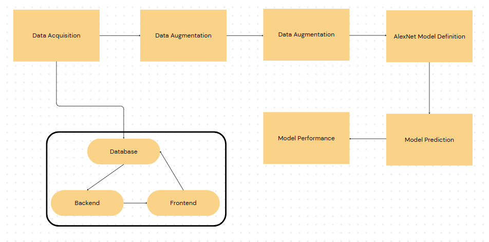

# HACKNITE'25
# PROJECT TITLE : AgriLens
(Because Google can't diagnose leaf drama)
This GIS-based system predicts plant diseases using spatial data and environmental factors, providing early warnings and insights to farmers for better crop management.

### INTRDUCTION:
Plant diseases significantly impact global food security, making early detection and prediction crucial for preventing crop losses. This project leverages Geographic Information System (GIS) technology to predict plant diseases by analyzing thermal and RGB plant images spatial data, soil conditions, and environmental factors. By predicting and detecting which disease the plant may have, the system provides early warnings and actionable insights to farmers. This enhances decision-making, optimizes resource allocation, and supports sustainable agriculture. To maximize accessibility, the platform will be available in multiple local languages, ensuring farmers in remote areas receive accurate disease forecasts and timely interventions, ultimately improving crop health and yields.

### SOLUTION:
Empowering farmers with AI-driven plant disease detection, this project enhances agricultural productivity through better decision-making. By combining remote sensing and AI it enables accurate disease forecasting and early identification using geo tagged thermal images of plants. Providing real-time insights, the system helps mitigate crop losses, improve food security, and revolutionize precision agriculture with smart, location-based disease monitoring.

### MODEL ARCHITECTURE: 

### TECH STACK: 
FRONT END:
- HTML+CSS
- Javascript

BACKEND: 
- Python
- Flask

DATABASES:
- MySql

MODEL: 
- AlexNet (CNN for image classification)

### USAGE
- **User Access:** Farmers can upload or capture images of affected crops through a web-based interface.
- **Processing:** The system analyzes the image using the AlexNet model and cross-references spatial data.
- **Prediction Output:** It provides a disease diagnosis, severity level, and suggested preventive measures.

Below are screenshots demonstrating the key features of AgriLens and how it assists farmers with plant disease prediction:
#### **Landing Page**

#### **Login Page**

#### **Signup Page**

#### **Home Page**

### CHALLENGES FACED
- **Data Collection & Preprocessing**: Acquiring high-quality labeled plant disease datasets and integrating diverse spatial data sources both thermal and RGB images.
- **Model Optimization:** Training the CNN model to achieve high accuracy while maintaining efficiency for real-time predictions.
- **Infrastructure & Connectivity:** Ensuring accessibility in rural areas with limited internet connectivity.
- **Language & Usability:** Adapting the system to multiple local languages for broader farmer adoption.

### FUTURE SCOPE
- **Improved Deep Learning Models:** Incorporating more advanced architectures such as Vision Transformers for enhanced accuracy.
- **IoT Integration:** Connecting sensors in farms to monitor soil moisture, temperature, and humidity in real-time.
- **Mobile App Development:** Creating a mobile-friendly version for easier farmer accessibility.
- **Blockchain for Data Security:** Ensuring secure and transparent data storage for disease trends and interventions.
- **Government & Research Collaborations:** Partnering with agricultural organizations for widespread adoption and refinement of predictive models.
